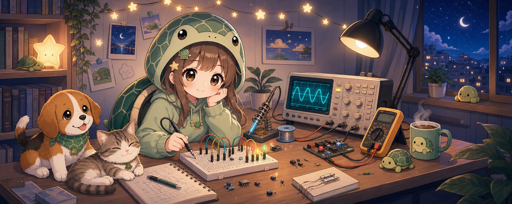

<!-- 想换横幅时，替换 assets/siturtle-room-banner.png 即可。 -->

<div align="center">



# 你好，这里是 Daigui233

平时是 **呆龟 Daigui**，干活时切换为 **硅龟 Siturtle**。  
硅龟 = 硅 + 龟，大概是一种正在学习电子信息的硅基生物态。

</div>

## 关于我

我是 **SYSU 电信院 24 级本科生**。

这里主要放一些学习记录、课程项目和偶尔折腾出来的小东西。  
技术力还在缓慢加载中，所以这个主页先当作一个比较可爱的自我介绍小角落。

## 最近在折腾

- **信号放大器设计**  
  高频电路、小信号放大、参数计算、焊接调试。

- **智能车项目**  
  做过一些智能车相关联调：`RK3588S` 上位机、`TC264D` 下位机、视觉巡线、AR / AprilTag 定位转发、串口控车和安全停车逻辑。  
  这个项目目前是 private，就先简单记一笔，后续会开源（如果后继有人的话）。

- **一些 EE 日常**  
  示波器、万用表、面包板、跳线和一些“为什么它又不工作了”的小问题。

## 呆龟 / 硅龟模式

```text
呆龟模式    缓慢加载中，偶尔发呆，适合晒太阳和补觉
硅龟模式    接上示波器和万用表，开始把问题拆开
当前状态    在电子信息的路上慢慢爬行
```

## 小小备忘

我不一定很厉害，但会尽量把做过的东西留下来。  
如果某天这里突然变得很像样，那大概是硅龟上线了。

---

<div align="center">

有事留言，没事别找我

</div>
